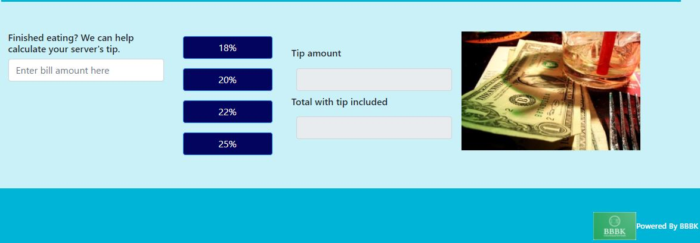

# CashingOutofTown

## 1. Pitch

Have you ever been visiting another city, and you're not sure where to dine, or how much to tip after eating? Well we've got you covered. This application is designed for out of town travelers. By entering your destination city, this site provides nine restaurants within any searched area to select from. After enjoying your meal, we will calculate your tip amount (from appropriate to generous) and total your bill. Pretty neat huh?

### User view of the deployed App.

Here is an image of CashingOutOfTown:

<!-- Demo image -->

## 2. See the CashingOutOfTown deployed for yourself!

### Click or Copy and Paste the link below into preferred browser to see the full CashingOutOfTown! 

https://hottiehotton.github.io/CashingOutofTown/

## 3. How to use the website.

### See the App in action.

The user types in the desired city. Then clicks the "Submit" button.

View nine restaurant options and their location.

Enter check total.

Click desired tip percentage.

JavaScript, Css and, HTML used for this deployment.

## 4. Contributors 
Kayce Heap, Braxton Hotton, Brett Peretti and, Ben Miller.

